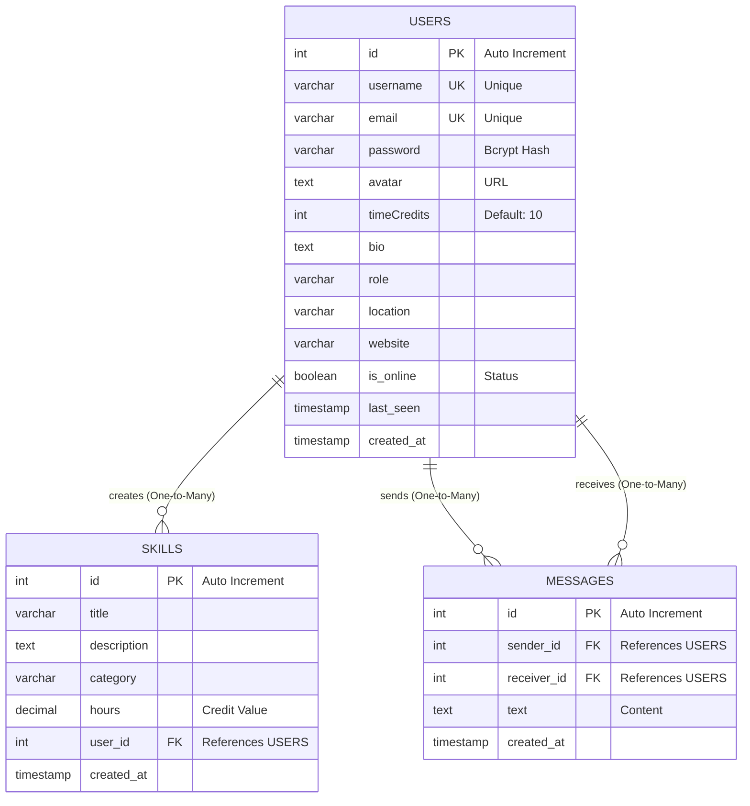

# Entity Relationship Diagram - SkillSwap (RTRP)

Based on the current database schema defined in `db/mysql_init.sql` and `skillswap_report.tex`.

## Schema Details

### 1. USERS Table
- **Primary Key:** `id`
- **Unique Constraints:** `username`, `email`
- **Description:** Stores user profile information, authentication details, and time credits.

### 2. SKILLS Table
- **Primary Key:** `id`
- **Foreign Key:** `user_id` -> `users.id` (ON DELETE CASCADE)
- **Description:** Represents skills offered by users for exchange.

### 3. MESSAGES Table
- **Primary Key:** `id`
- **Foreign Keys:** 
  - `sender_id` -> `users.id` (ON DELETE CASCADE)
  - `receiver_id` -> `users.id` (ON DELETE CASCADE)
- **Description:** Stores chat history between users.
